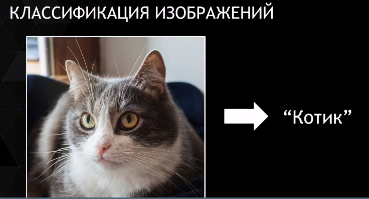

# Deep Learning -> Computer Vision

karistirma! => машинное зрение и компьютерное это разные веши

## Компьютерное зрение:
semantik bilig demektir (semantik = analm bilim)

# Классификация изоображений
надо улавить суть картинки и определить к какому калссу это относиться, например кот на картинке

> если нужно усложнить то определяем местоположение на картинке и берем в рамку -> см семантику

>Heatmap => цветом указываем где находится тот или иной объект

# Детектирование (Локализацию) Объекта
если несколько объектов на картинке мы не можем сказать что там только кот или только пес, например пару песелей и кот, уже идет детектирование. Калссификация + локализация = Детектирование.

Детектирование, если на картинке лица людей и хотим закласифицировать то сначала делаем детектирование. Так же товар на полках.

> в этом деле важно делать все в реальном времени)) ну как бЭЭЭ да...

**Семантическая и Объектная Сегментация**

>семантическая сегментация -> поиск произвольной формы, здесь рассамтриваем высокоуровневую, (не просто по одному цвету сказали это один объект)

> если нужно разделить на объекты один и тот же класс то делаем сегментацию объектов

пример: идет сегментация машин, людей и всего окружения

# Изоображение:

просто матрица с интенсивностью яркостью пикселя 

показывается обычно 8-битовое число

>диапазон может быть от 0-255 либо аналог 0-1

3 означает сколько каналов, у нас их три RGB, как лэйер в фотошопе изоображение полностью окрашивается в соответсвенный канал и в конце накладывается друг на друга

другие системы нотации
> hsv = для каждого пикселя
> hue = тон, бежим по кругу берем шо нада
> saturation = насыщенность, не насыщенный это сероватый оттенок соответсвенно
> value = яркость

>YUV = отделяется яркость от самих цветов, и если надо оставить цвет но поиграться с яркостью вместо того что бы усреднять значения rgb (что приведет к потере (возмможно)) правильнее будет перевести в данную систему цветов, и то же самое наоборот, изменим цвет без изменений яркости

если условимся что изоображение это просто матрица, ,то линейное прообразование будет означать применение какой либо функции для каждого пикселя в цикле папример, умножение значения пикселя повысит яркость в целом, также и наоборот если поделим на 2.

в такой практике это плохо тем что если значение близко к нулю (0-1 макс) то умножение на 2 заставит выпрыгнуть за пределы максимума, и придется обрезать данные, см функцию мап в ардуино ;)

от этого и идет использование не линейных функций, где белый и черный фиксируем а остальной диапазон настраиваем 

здесь уже нет переполнений (нелинейно)

затемнение - также стабильно остается белый и черный

**Цветное линейное/нелинейное преобразование**

делается то же самое только для каждого канала отдельно)

>фишка в том что для каждого канала можно будет разные алгоритмы применять ;)

пример того как темные цвета делаются более темными а светлые более светлыми - > получим просто более контрастное изоображение

> выше приведенное относится к применению функции к одному пикселю

> если возьмем среднее значение rgb то в конце будем иметь ю канал тобиж **rgb -> grayscale**

>  
